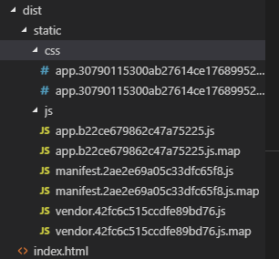
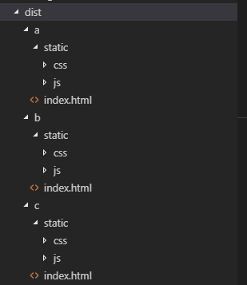

# vue-multipage-template

> 最近一个项目中需求分为业务系统、后台管理系统两个模块，在查询了相关vue分模块打包的信息后，将解决方案整理为模板记录下来。本项目使用`vue-cli2.9.6`创建项目，然后更改相关配置后实现各模块分开打包。

## Build Setup

``` bash
# install dependencies
npm install

# serve with hot reload at localhost:8080
npm run dev

# build for production with minification
npm run build

# build for production and view the bundle analyzer report
npm run build --report
```

For a detailed explanation on how things work, check out the [guide](http://vuejs-templates.github.io/webpack/) and [docs for vue-loader](http://vuejs.github.io/vue-loader).

## 原理剖析

刚创建的项目打包结构如下：


初始状态下就是将整个项目当做一个模块来打包处理，现在我们有多个模块，假设分别为a、b、c，那我们先获取所有的模块，然后遍历模块列表，在每次遍历中调用build.js打包当前模块即可。最后的打包效果如下：


.

## 打包配置修改

1. 在`utils.js`文件结尾增加如下内容，用来获取模块列表：

   ```javascript
   const glob = require('glob')
   
   // 获取模块名称列表
   var moduleList = []
   var moduleScrArray = glob.sync('./src/modules/*')
   
   moduleScrArray.forEach(function(modulePath){
     moduleList.push(modulePath.split('/')[3])
   })
   
   exports.moduleList = moduleList
   ```

2. 在build文件夹中新建`build-all.js`，用来遍历模块构建，代码如下：

   ```javascript
   const path = require('path')
   const execFileSync = require('child_process').execFileSync
   const utils = require('./utils')
   
   const buildFile = path.join(__dirname, 'build.js')
   
   const moduleList = utils.moduleList || []
   
   moduleList.forEach(moduleName => {
     console.log('正在打包模块', moduleName)
     // 创建同步进程
     execFileSync('node', [buildFile, moduleName], {})
   })
   ```

3. 在`build.js`中获取当前打包模块名称：

   ```javascript
   // 当前打包模块的名称
   let moduleName = process.argv[2]
   if(moduleName){
     process.env.MODULE_ENV = moduleName
   } else {
     return false
   }
   
   // 根据当前打包模块设置入口
   webpackConfig.entry = {}
   webpackConfig.entry[moduleName] = `./src/modules/${moduleName}/main.js`
   ```

4. 修改`/config/index.js`中build相关配置，添加/修改内容如下：

   ```javascript
   let moduleName = process.env.MODULE_ENV || 'undefined'
   
   module.exports ={
       build: {
           // Template for index.html
           // index: path.resolve(__dirname, '../dist/index.html'),
           index: path.resolve(__dirname, '../dist', moduleName, 'index.html'),
           htmlTemplate: `./src/modules/${moduleName}/index.html`,
   
           // Paths
           // assetsRoot: path.resolve(__dirname, '../dist'),
           assetsRoot: path.resolve(__dirname, '../dist', moduleName),
       }
   }
   ```

5. 修改`webpack.prod.conf.js`中`HtmlWebpackPlugin`配置：

   ```javascript
   // 只需要修改其中的template属性即可
   new HtmlWebpackPlugin({
       filename: config.build.index,
       // template: 'index.html',
       template: config.build.htmlTemplate,
       inject: true,
       minify: {
           removeComments: true,
           collapseWhitespace: true,
           removeAttributeQuotes: true
           // more options:
           // https://github.com/kangax/html-minifier#options-quick-reference
       },
       // necessary to consistently work with multiple chunks via CommonsChunkPlugin
       chunksSortMode: 'dependency'
   }),
   ```

6. 最后将package.json --> scrpits中的build命令修改为`"build": "node build/build-all.js"`，然后运行`npm run build`即可分模块打包


## 运行配置修改（webpack-dev-server）

1. 在`webpack.base.conf.js`中修改entry入口文件配置：

   ```javascript
   // entry: {
   //   app: './src/main.js'
   // },
   //修改为多入口
   entry(){
       const entry = {}
       const moduleToBuild = utils.moduleList || []
       moduleToBuild.forEach(moduleName => {
           entry[moduleName] = `./src/modules/${moduleName}/main.js`
       })
   
       return entry
   },
   ```

2. 在`webpack.base.conf.js`中修改html模板文件配置：

   ```javascript
   // https://github.com/ampedandwired/html-webpack-plugin
   // new HtmlWebpackPlugin({
   //   filename: 'index.html',
   //   template: 'index.html',
   //   inject: true
   // }),
   
   // 注释掉原先的配置，在末尾添加如下内容：
   utils.moduleList.forEach(moduleName => {
     // 配置生成html文件
     devWebpackConfig.plugins.push(new HtmlWebpackPlugin({
       filename: `modules/${moduleName}/index.html`,
       template: `./src/modules/${moduleName}/index.html`,
       inject: true,
       // 这个很重要
       chunks: [moduleName]
     }))
   })
   ```

3. 运行`npm start`，通过`{ip}:{port}/modules/{moduleName}/#/`即可访问了，例如：http://localhost:8080/modules/a/#/


参考文章：

[vue单页多页的开发环境配置+vue的开发思路](https://segmentfault.com/a/1190000009543196)

[基于vue-cli搭建多模块且各模块独立打包的项目](https://segmentfault.com/a/1190000014571631)
[vue-cli实现多页面多路由](https://blog.csdn.net/chen1218chen/article/details/74373491)


